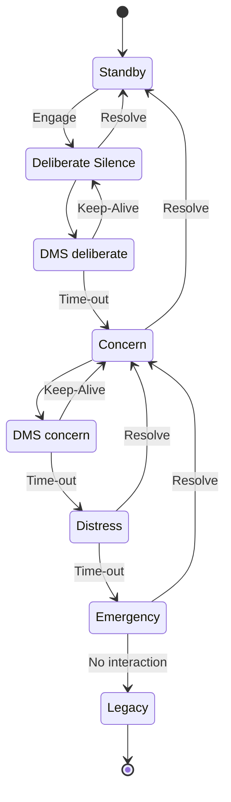

# incommunicado

A non-contact management solution with a safety rider

```mermaid
stateDiagram-v2

    state "Standby" as STB
    state "Deliberate Silence" as LOC
    state "DMS deliberate" as DMSd
    state "DMS concern" as DMSc
    state "Concern" as CON
    state "Distress" as DIS
    state "Emergency" as EME
    state "Legacy" as LEG

    [*] --> STB
    STB --> LOC: Engage
    LOC --> DMSd 
    DMSd --> LOC: Keep-Alive
    LOC --> STB: Resolve
    DMSd --> CON: Time-out
    CON --> DMSc
    DMSc --> CON: Keep-Alive
    CON --> STB: Resolve
    DMSc --> DIS: Time-out
    DIS --> CON: Resolve
    DIS --> EME: Time-out
    EME --> CON: Resolve
    EME --> LEG: No interaction
    LEG --> [*]
```
