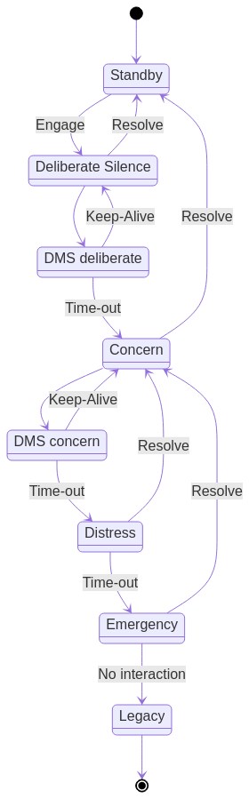

# incommunicado

A non-contact management solution with a safety rider

## General workflow

[]

## Lists

### L1: Friends and Family

This is the list of personally relevant people the user wants to notify if they go _incommunicado_.

### L2: Concern list

All ements of List 1, plus a second group, consisting
possibly of professional contacts, therapists, counselors,
ministers - anyone who might be inclined to initiative a
wellness check.

### L3: Distress and Emergency

All elements of List 2, plus the inclusion of
Authorities, emergency services, anyone who
could assist in the event of a serious
incapacitating health crisis, physical or mental.

## Messaging

Each state has a corresponding messages and expanding distribution list.

| State | Event   | List | Message   |
|-------|---------|------|-----------|
| LOC   | New     | L1   | Intro     |
| LOC   | Alive   | L1   | Alive D   |
| LOC   | Resolve | L1   | Resolve   |
| CON   | New     | L1   | Intro C   |
| CON   | Enter   | L2   | Warn C    |
| CON   | Alive   | L1   | Alive C   |
| CON   | Resolve | L1   | Resolve   |
| DIS   | New     | L2   | Distress  |
| DIS   | Enter   | L2   | Warn D    |
| DIS   | Resolve | L2   | Resolve D |
| EME   | New     | L3   | Emergency |
| EME   | Enter   | L3   | Warn EME  |
| EME   | Resolve | L3   | Resolve E |
| LEG   | Enter   | L3   | Legacy    |
